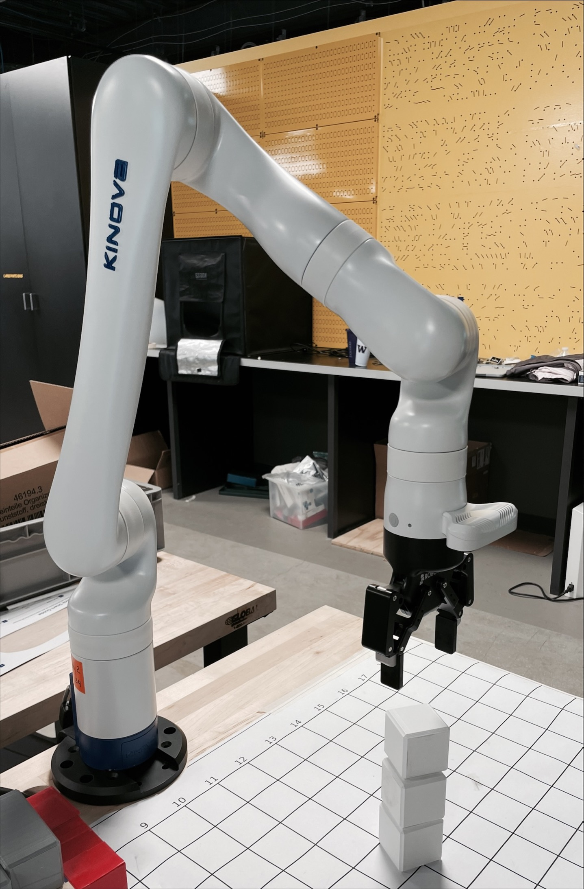

A very simple kinova arm controlling project
======


created by [@Tongyuang](https://github.com/Tongyuang), inspired by the [kinova-ros](https://github.com/Kinovarobotics/kinova-ros) repo for the engine, credit to [@Queenie Qiu](https://github.com/QueenieOhYeah) and Prof. [@John Raiti](https://people.ece.uw.edu/raiti_john/) for their help from TECHIN 514 course at Global Innovation Exchange(GIX), UW. [More about GIX](https://gix.uw.edu/)

---

## 1. Description




We are using the [KINOVA gen3 arm](https://www.kinovarobotics.com/product/gen3-robots) for this project to grab some cubes and stack them up one by one.

To be specific, three cubes with size of $5cm$ are placed on given positions, the arm will pick up these cubes one by one, and put the cubes to the target position in a stack. 

The initial positions of the cubes and the target position is pre-defined, and the process is an open-loop control, which means it's not aware of where the cubes are actually, it just follow the commands to reach specific points step by step.

## 2. Setup

**2.1 Robot Arm**
    [KINOVA gen3 arm](https://www.kinovarobotics.com/product/gen3-robots) with dof = 6, theoretically, the dof for gen3 should be 7 and gen3_lite should be 6, but our arm has dof=6 instead.
    The gripper we use is from [ROBOTIQ 2F-85](https://robotiq.com/products/2f85-140-adaptive-robot-gripper).

**2.2 Environment**
    Ubuntu 20.04.5 LTS + ROS noetic + Python 3.x


## 3. Run

   - Make sure you have already have the kortex environment setup properly.
   
   ```bash
$ sudo apt install python3 python3-pip
$ sudo python3 -m pip install conan
$ conan config set general.revisions_enabled=1
$ conan profile new default --detect > /dev/null
$ conan profile update settings.compiler.libcxx=libstdc++11 default
$ cd catkin_ws/src
$ git clone https://github.com/Kinovarobotics/ros_kortex.git
$ cd ../
$ rosdep install --from-paths src --ignore-src -y
   ```

   After you have all the dependencies installed, build and source the worksapce:

   ```bash
$ catkin_make
$ source devel/setup.bash
   ```

- After that, launch a kortex_driver in the terminal:

```bash
$ roslaunch kortex_driver kortex_driver.launch arm:=gen3 dof:=6
gripper:=robotiq_2f_85 ip_address:= <robot ip address>
```
In my case, the robot ip is 10.155.234.34.

- Implement the controller by
```bash
# set the namespace
$ export ROS_NAMESPACE="/my_gen3/"
# remember to install all the required libraries
$ python kinova_controller.py
```
The pick-and-place process can be customized by modifing the parameters in the ```kinova_pickupsetting.json```file. One can customize the positions of the cubes and the target there.

# DEMO

[demo video here](https://youtu.be/DASVuYxZY0g)

